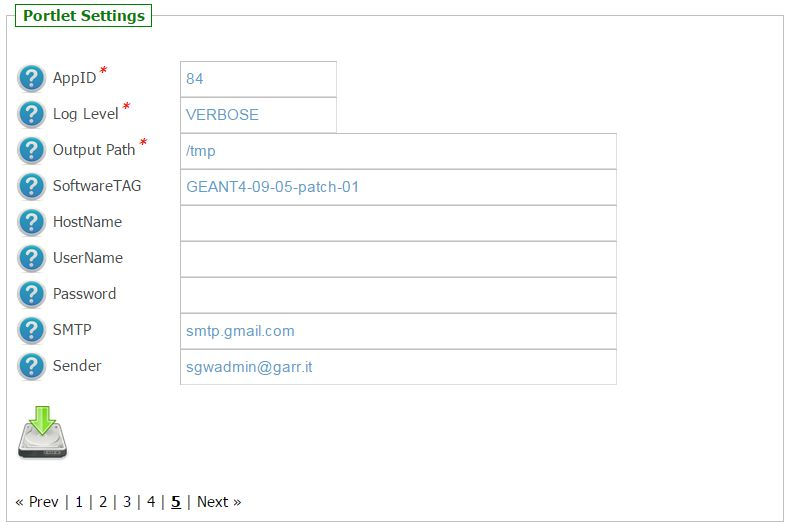

*********************
IORT 
*********************

============
About
============

.. _1: http://www.ro-journal.com/content/8/1/80

IntraOperative Electron Radiotherapy (IOERT) [1_] is a radiotherapy technique that delivers a single dose of radiation directly to the tumor bed, or to the exposed tumor, during surgery. The objective is to achieve a higher dose in the target volume while dose-limiting structures are surgically displaced. IOERT is used for limited-stage breast tumors treatment and also successfully for prostate, colon and sarcoma cancers. For this purpose, a new generation of mobile linear accelerators has been designed to deliver radiation therapy in the operating theater.

As in conventional radio-therapy techniques, the use of Monte Carlo simulations is mandatory to design the beam collimation system and to study radioprotection charactheristics as the radiation leakages. In the clinical activities the simulations can be used to commissioning of the linac and in the optimization of the therapeutic dose and patient radioprotection. 

============
Installation
============
To install this portlet the WAR file has to be deployed into the application server.

As soon as the portlet has been successfully deployed on the Science Gateway the administrator has to configure:

- the list of e-Infrastructures where the application can be executed;

- some additional application settings.

1.) To configure a generic e-Infrastructure, the following settings have to be provided:

**Enabled**: A true/false flag which enables or disable the generic e-Infrastructure;

**Infrastructure**: The acronym to reference the e-Infrastructure;

**VOName**: The VO for this e-Infrastructure;

**TopBDII**: The Top BDII for this e-Infrastructure;

**WMS Endpoint**: A list of WMS endpoint for this e-Infrastructure (max. 10);

**MyProxyServer**: The MyProxyServer for this e-Infrastructure;

**eTokenServer**: The eTokenServer for this e-Infrastructure;

**Port**: The eTokenServer port for this e-Infrastructure;

**Serial Number**: The MD5SUM of the robot certificate to be used for this e-Infrastructure;

In the following figure is shown how the portlet has been configured to run simulation on the Italian e-Infrastructure.

.. image:: images/IORT_settings.jpg
   :align: center

2.) To configure the application, the following settings have to be provided:

**AppID**: The ApplicationID as registered in the UserTracking MySQL database (GridOperations table);

**Software TAG**: The list of software tags requested by the application;

**SMTP Host**: The SMTP server used to send notification to users;

**Sender**: The FROM e-mail address to send notification messages about the jobs execution to users;

.. _GARR: https://sgw.garr.it/

In the figure below is shown how the application settings have been configured to run on the GARR_ Science Gateway.

============
Usage
============

To run the Monte Carlo simulations the user has to:

- click on the *third* accordion of the portlet,

- upload the macro as ASCII file OR paste its content in the below textarea, and

- select the number of jobs to be executed as shown in the below figure:

.. image:: images/IORT_inputs.jpg
      :align: center

Each simulation will produce:

- *std.txt*: the standard output file;

- *std.err*: the standard error file;

- *.tar.gz*: containing the results of the Monte Carlo simulation.

A typical simulation produces, at the end, the following files:

.. code:: bash

        ]$ tree IortTherapySimulationStarted_646/
        IortTherapySimulationStarted_646/
        ├── std.err
        ├── std.txt
        ├── output.README
        └── results.tar.gz

The list of files produced during the run are the following:

.. code:: bash

        ]$ tar ztvf results.tar.gz
        currentEvent.rndm
        currentRun.rndm
        Dose.out
        Energy_MeV.out

============
References
============

.. _2: http://ceur-ws.org/Vol-993/paper5.pdf

* Concurrancy and Computation: Practice and Experience (2014). Published online in Wiley Online Library. DOI: 10.1002/cpe.3268: *"A GEANT4 web-based application to support Intra-Operative Electron Radiotherapy usign the European grid infrastructure"* – 2014 [2_];

============
Contributor(s)
============
Please feel free to contact us any time if you have any questions or comments.

.. _INFN: http://www.ct.infn.it/
.. _INFN_LNS: http://www.lns.infn.it/
.. _LATO: http://www.polooncologicocefalu.it/

:Authors:
 
 Roberto BARBERA - Italian National Institute of Nuclear Physics (INFN_),

 Carlo CASARINO - LAboratorio di Tecnologie Oncologiche (LATO_),
 
 Giuliana Carmela CANDIANO - LAboratorio di Tecnologie Oncologiche (LATO_),
  
 Giuseppe Antonio Pablo CIRRONE - Italian National Institute of Nuclear Physics (LNS) INFN_LNS_,
 
 Susanna GUATELLI - Centre for Medical Radiation Physics, School of Engineering Physics, University of Wollongong, NSW 2522 Australia,
 
 Giuseppe LA ROCCA - Italian National Institute of Nuclear Physics (INFN_)
 
